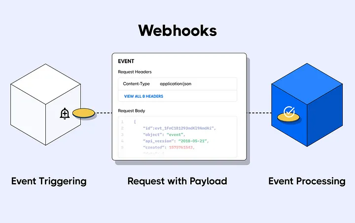
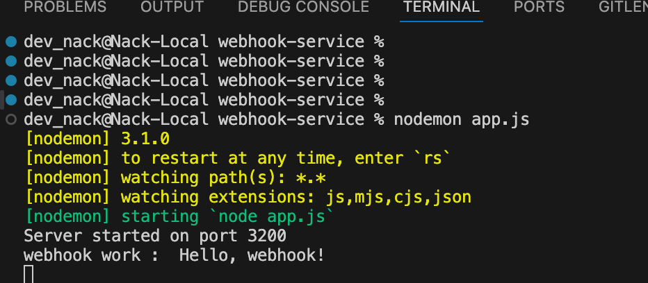

# webhook-service



## Triggering an Event

To trigger an event using the webhook service, follow these steps:

1.**Endpoint URL**: Use the following endpoint URL to 

``` javascript
http://localhost:3200/api/webhook
```

2.**Payload URL**: The body of the request should be a JSON object containing the event details.

``` javascript
curl -X POST http://localhost:3200/api/webhook \
-H "Content-Type: application/json" \
-d '{"message": "Hello, webhook!"}'
```
2.**Result**: On Server will console.log(message-event)


